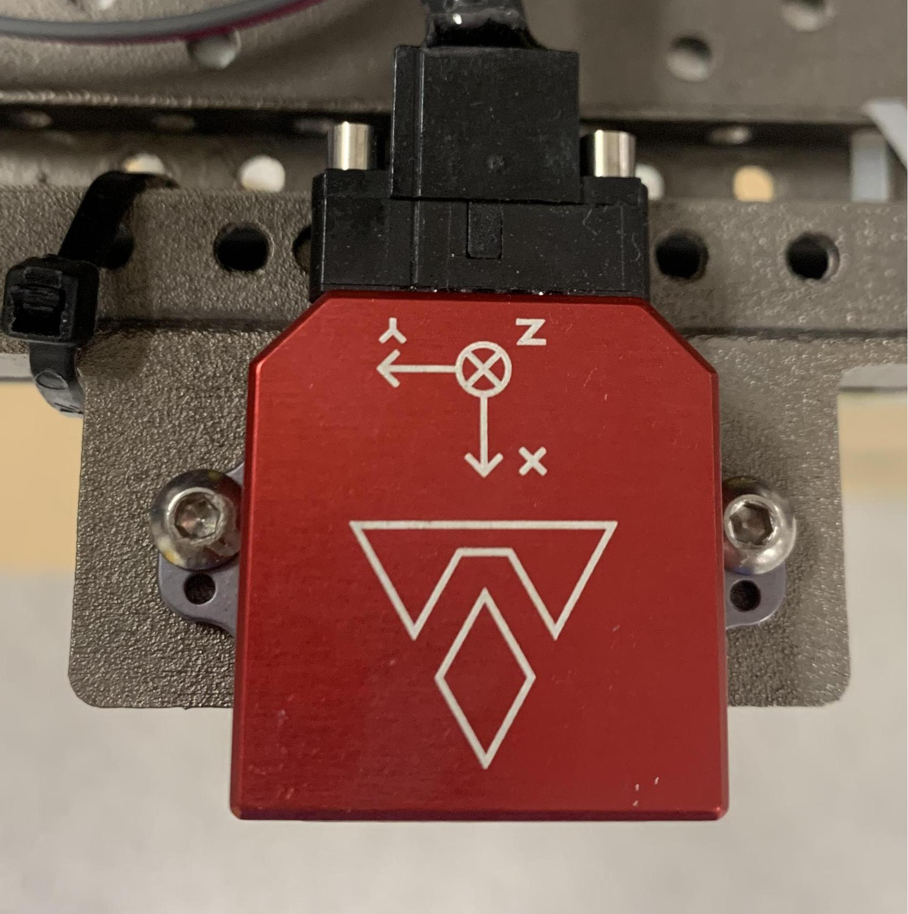

# Sensors & Usage

## Overview

The sensor setup is illustrated in [Fig. 1](#fig-harware). The corresponding ROS topics are reported in [Tab. 1](#tab-sensor-and-topic).

<p align="center">
    
</p>
<p style="text-align: center;">Fig 1. The research UAV with its sensors and corresponding coordinate frames </p> <a name="fig-hardware"></a>

<p style="text-align: center;">Table 1. Sensors and their ROS topics</p> <a name="tab-sensor-and-topic"></a>
<style type="text/css">
.tg  {border-collapse:collapse;border-spacing:0;}
.tg td{border-color:black;border-style:solid;border-width:1px;font-family:Arial, sans-serif;font-size:14px;
  overflow:hidden;padding:0px 0px;word-break:normal;}
.tg th{border-color:black;border-style:solid;border-width:1px;font-family:Arial, sans-serif;font-size:14px;
  font-weight:normal;overflow:hidden;padding:0px 0px;word-break:normal;}
.tg .tg-lboi{border-color:inherit;text-align:left;vertical-align:middle}
.tg .tg-9wq8{border-color:inherit;text-align:center;vertical-align:middle}
.tg .tg-c3ow{border-color:inherit;text-align:center;vertical-align:top}
.tg .tg-0pky{border-color:inherit;text-align:left;vertical-align:top}
</style>
<table class="tg">
<thead>
  <tr>
    <th class="tg-c3ow">No.</th>
    <th class="tg-c3ow">Sensor</th>
    <th class="tg-c3ow">Manufacturer<br>&amp; Product name</th>
    <th class="tg-0pky">ROS topic name</th>
    <th class="tg-0pky">Message Type</th>
    <th class="tg-0pky">Nominal Rate</th>
  </tr>
</thead>
<tbody>
  <tr>
    <td class="tg-9wq8" rowspan="3">1</td>
    <td class="tg-9wq8" rowspan="3">IMU</td>
    <td class="tg-9wq8" rowspan="3">VectorNav<br>VN100</td>
    <td class="tg-lboi">/imu/imu</td>
    <td class="tg-lboi">sensor_msgs/Imu</td>
    <td class="tg-lboi">385 Hz</td>
  </tr>
  <tr>
    <td class="tg-lboi">/imu/magnetic_field</td>
    <td class="tg-lboi">sensor_msgs/MagneticField</td>
    <td class="tg-lboi">385 Hz</td>
  </tr>
  <tr>
    <td class="tg-lboi">/imu/temperature</td>
    <td class="tg-lboi">sensor_msgs/Temperature</td>
    <td class="tg-lboi">385 Hz</td>
  </tr>
  <tr>
    <td class="tg-9wq8" rowspan="2">2</td>
    <td class="tg-9wq8" rowspan="2">Horizontal Lidar</td>
    <td class="tg-9wq8" rowspan="2">Ouster<br>OS1-16 gen 1</td>
    <td class="tg-lboi">/os1_cloud_node1/imu</td>
    <td class="tg-lboi">sensor_msgs/Imu</td>
    <td class="tg-lboi">100 Hz</td>
  </tr>
  <tr>
    <td class="tg-lboi">/os1_cloud_node1/points</td>
    <td class="tg-lboi">sensor_msgs/PointCloud2</td>
    <td class="tg-lboi">10 Hz</td>
  </tr>
  <tr>
    <td class="tg-9wq8" rowspan="2">3</td>
    <td class="tg-9wq8" rowspan="2">Vertical Lidar</td>
    <td class="tg-9wq8" rowspan="2">Ouster<br>OS1-16 gen 1</td>
    <td class="tg-lboi">/os1_cloud_node2/imu</td>
    <td class="tg-lboi">sensor_msgs/Imu</td>
    <td class="tg-lboi">100 Hz</td>
  </tr>
  <tr>
    <td class="tg-lboi">/os1_cloud_node2/points</td>
    <td class="tg-lboi">sensor_msgs/PointCloud2</td>
    <td class="tg-lboi">10 Hz</td>
  </tr>
  <tr>
    <td class="tg-9wq8">4</td>
    <td class="tg-9wq8">Camera 1</td>
    <td class="tg-9wq8">uEye 1221 LE<br>(monochome)</td>
    <td class="tg-lboi">/left/image_raw</td>
    <td class="tg-lboi">sensor_msgs/Image</td>
    <td class="tg-lboi">10 Hz</td>
  </tr>
  <tr>
    <td class="tg-9wq8"></td>
    <td class="tg-9wq8">Camera 2</td>
    <td class="tg-9wq8">uEye 1221 LE<br>(monochome)</td>
    <td class="tg-lboi">/right/image_raw</td>
    <td class="tg-lboi">sensor_msgs/Image</td>
    <td class="tg-lboi">10 Hz</td>
  </tr>
  <tr>
    <td class="tg-9wq8" rowspan="3">5</td>
    <td class="tg-9wq8" rowspan="3">UWB</td>
    <td class="tg-9wq8" rowspan="3">Humatic P440</td>
    <td class="tg-lboi">/uwb_endorange_info</td>
    <td class="tg-lboi">uwb_driver/UwbRange</td>
    <td class="tg-lboi">68.571 Hz</td>
  </tr>
  <tr>
    <td class="tg-lboi">/uwb_exorange_info</td>
    <td class="tg-lboi">uwb_driver/UwbEcho</td>
    <td class="tg-lboi">5.714 Hz</td>
  </tr>
  <tr>
    <td class="tg-lboi">/node_pos_sc</td>
    <td class="tg-lboi">nav_msgs/Path</td>
    <td class="tg-lboi">5.714 Hz</td>
  </tr>
  <tr>
    <td class="tg-9wq8">6</td>
    <td class="tg-9wq8">3D Laser Tracker</td>
    <td class="tg-9wq8">Leica MS60 TotalStation</td>
    <td class="tg-lboi">/leica/pose/relative</td>
    <td class="tg-lboi">geometry_msgs/PoseStamped</td>
    <td class="tg-lboi">20 Hz</td>
  </tr>
</tbody>
</table>

## IMU

The IMU is a 9-DoF inertia sensor. The frame of reference attached to this sensor is considered the _body frame_ of the whole setup.

<p align="center">
    
</p>
<p style="text-align: center;">Fig 2. The IMU frame of reference </p> <a name="fig-hardware"></a>

Internally, a filter fuses gyroscope, acceleration, and magnetic field measuremnts and outputs the orientation result on the /imu/imu topic. Though our dataset does not have orientation groundtruth, user can consider this orientation estimate as an external referenes.

## Lidar

The Lidar model used for this dataset is OS1-16 gen 1 from Ouster. Each message under the topic /os1_cloud_node1/points or /os1_cloud_node2/points corresponds to a full 360&deg; scan, which can be converted to a pointcloud of resolution 16x1024. Notice that besides the common x, y, z, intensity fields, each point in the pointcloud also contains time, reflectivity, ring, noise, range information of the laser firing.
To fully access these information, add the following definition of the Ouster point type to your code:

```cpp
struct PointXYZIRT
{
    PCL_ADD_POINT4D;
    float intensity;
    uint32_t t;
    uint16_t reflectivity;
    uint8_t  ring;          // The channel index
    uint16_t noise;
    uint32_t range;         // The distance measurement
    EIGEN_MAKE_ALIGNED_OPERATOR_NEW
} EIGEN_ALIGN16;

POINT_CLOUD_REGISTER_POINT_STRUCT(PointXYZIRT,
                                  (float, x, x)
                                  (float, y, y)
                                  (float, z, z)
                                  (float, intensity, intensity)
                                  (uint32_t, t, t)
                                  (uint16_t, reflectivity, reflectivity)
                                  (uint8_t,  ring, ring)
                                  (uint16_t, noise, noise)
                                  (uint32_t, range, range))
```

Below is an example callback that converts the ros message sensor_msgs/PointCloud2 to an object of type pcl::Pointcloud<PointXYZIRT>

```cpp

// Global variable to store the cloud data
pcl::PointCloud<PointXYZIRT>::Ptr laserCloudIn;

// Callback of topic /os1_cloud_node1/points
void cloudHandler(const sensor_msgs::PointCloud2::ConstPtr &msg)
{
    laserCloudIn = pcl::PointCloud<PointXYZIRT>::Ptr(new pcl::PointCloud<PointXYZIRT>());
    pcl::fromROSMsg(*msg, *laserCloudIn);
}
```